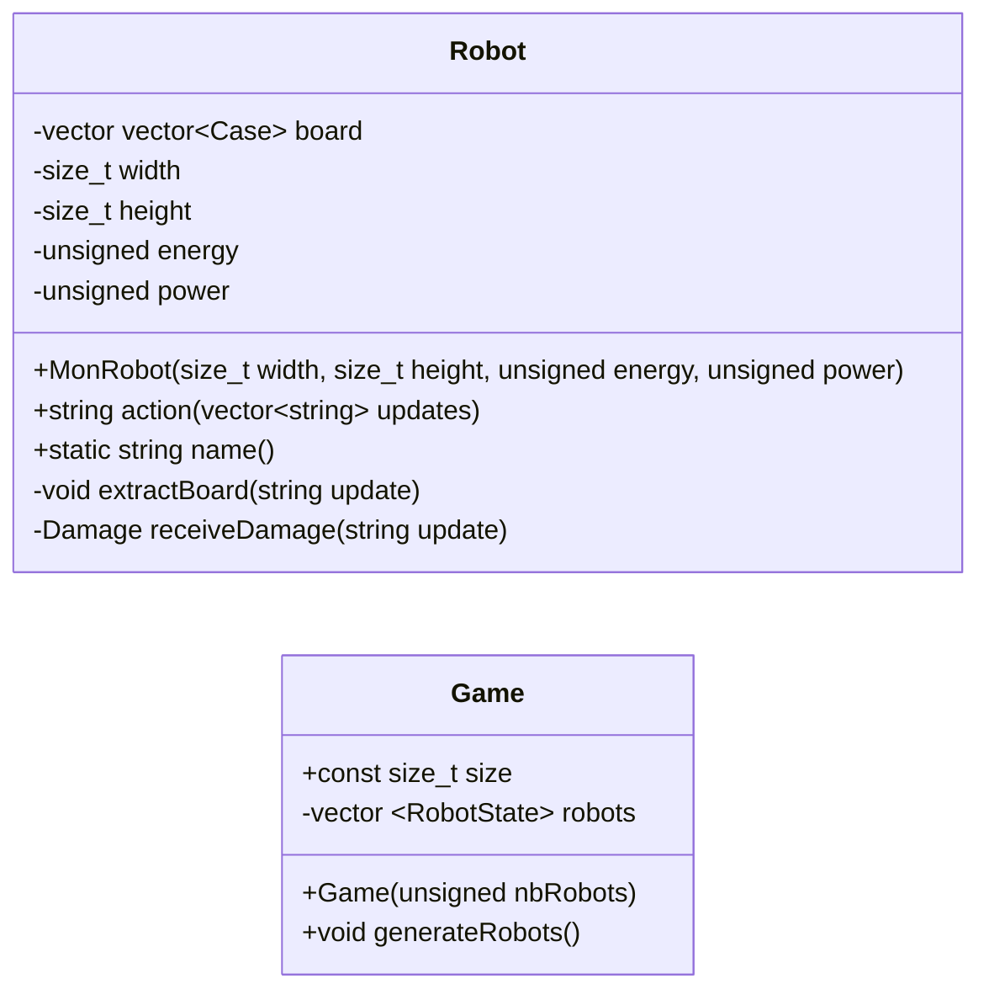

# Last robot standing

## Conception
### Class diagram


### Enums
```cpp
enum Case { EMPTY, SELF, OTHER, BONUS };
```

### Struct
```cpp
struct Damage {
	int attackerX;
	int attackerY;
	unsigned energyLoss;
}
```

```cpp
struct RobotState {
	int x;
	int y;
	unsigned energy;
	unsigned power;
	Robot robot;
}
```
