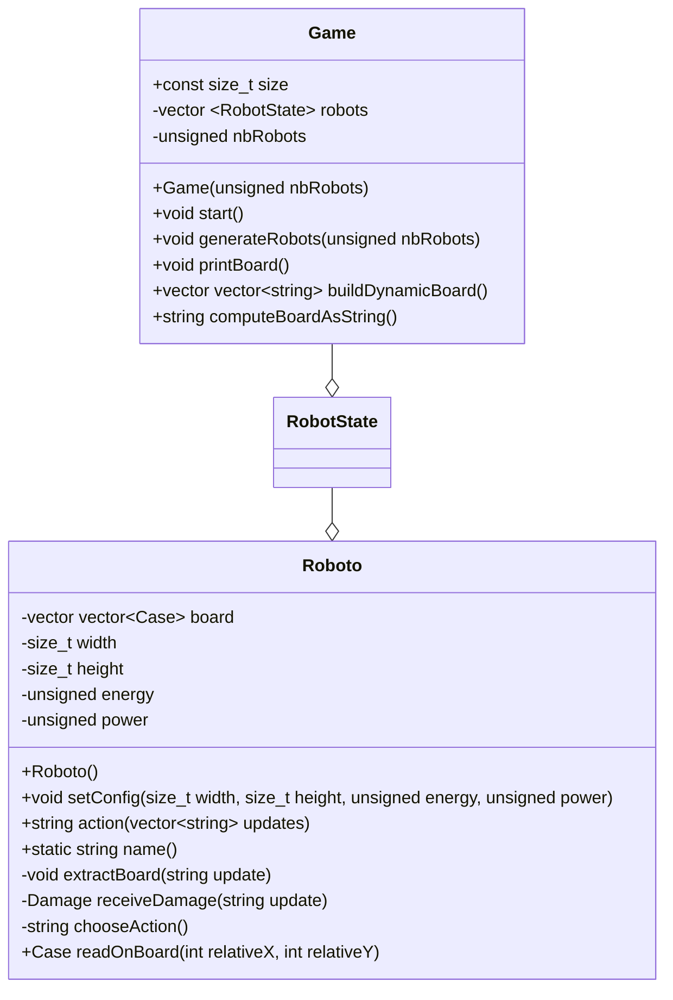

# Last robot standing

## Conception
### Class diagram


### Enums
```cpp
enum Case { EMPTY, SELF, OTHER, BONUS };
```

### Struct
```cpp
struct Damage {
	int attackerX;
	int attackerY;
	unsigned energyLoss;
}
```

### Algorithms
Pseudocode of roboto strategy:
```

```

g++ main.cpp _deps/libdio-src/src/display.cpp -I_deps/libdio-src/include -o main

