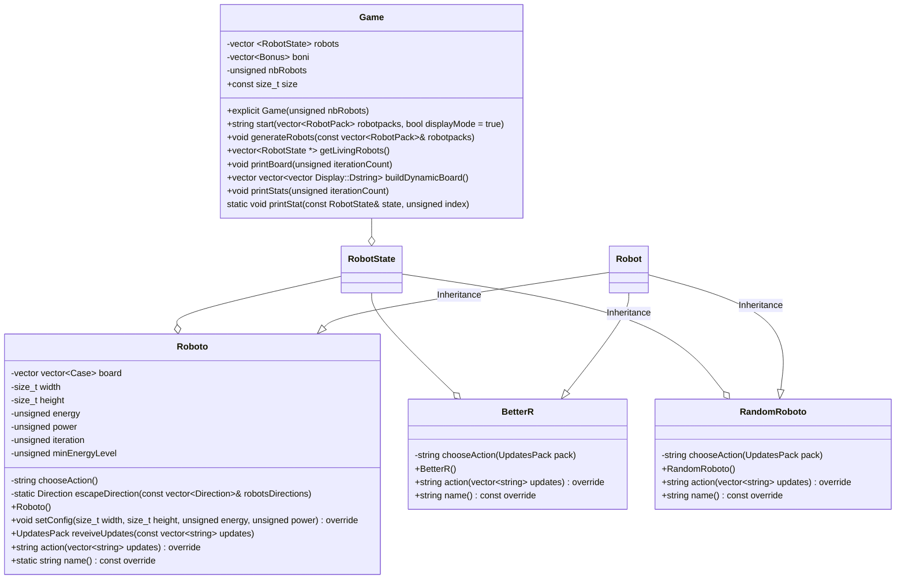

# LastRobotStanding
A Game called LastRobotStanding, developed in C++ in the terminal for the PRG1 class. The project is graded.

## How to use
You need cmake and git.
1. Clone the repos: `git clone https://github.com/HEIGVD-PRG1-F-2022/lab06-lastrobotstanding-roboto.git`
1. Compile the project (if you don't have CLion): `cmake . -Bbuild && cmake --build build/`
1. Execute the binary: `./build/LastRobotStanding`

This project can be developed in CLion (CMakeLists.txt available) or other IDE such as VSCode.

## Visual overview
View of the game:

View of the test mode (running hundreds of rounds without display to test robots' strategy):
TODO

## Review of the teacher
The code review and the grade is available here: https://github.com/HEIGVD-PRG1-F-2022/lab06-lastrobotstanding-roboto/pull/1

## Conception
### Class diagram


*Note: Mermaid doesn't support nested types (so `vector vector<string> structure` is given as a replacement of `vector<vector<string>> structure`).*

### Enums
```cpp
enum Case { EMPTY, SELF, OTHER, BONUS };
```

### Struct
```cpp
struct UpdatesPack {
    Message boardUpdate;
    std::vector<Message> bonusUpdates;
    std::vector<Message> damageUpdates;
};
```

### Algorithms

Goals:
- getting a lot of bonus
- getting bonus or escaping is a priority when
- avoid collisions

case: when an attack received

case si attack received proche et forte, le robot en face a plus de power que nous, fuite.
TODO remove this part.


**Pseudocode of Roboto's strategy:**
```cpp
int minEnergyLevel = 10;
iteration = 0
FUNCTION chooseAction()
	const float nbRobots = (size / 10)^2 //estimated number of robots (a bit under the real value)
	IF energy > minEnergyLevel 
		IF bonus in the zone
			IF bonus is touching us
				IF another robot is touching the bonus
					Attack the other robot
				ELSE
					take the bonus

			ELSE IF robot touching
				attack the closest robot
			
			IF no other visible robot is nearer than us

		ELSE IF at least robot in the zone
			Attack the closest robot

		ELSE
			Move diagonal simple and change direction randomly

	ELSE
		IF BONUS in the zone
			IF no other visible robot is nearer than us
				Go in the bonus direction
			ELSE
				Attack the robot that is the closest from the bonus
		ELSE IF at least robot in the zone
			Move to escapeDirection(board)
		ELSE //no robot nor bonus in the zone
			Move diagonal simple and change direction randomly

	ENDIF

	minEnergyLevel += iteration % (20 / nbRobots) == 0 ? 1 : 0;

ENDFUNCTION

FUNCTION escapeDirection(board)
	Map touchingRobotsPerCells
	
	FOR EACH touching cell including self cell around the robot
		Calculate number of touching robots
		Store number in a map touchingRobotsPerCells at index cell
		Calculate number of distant robots (magnitude >= 2)
		Store number in a map distantRobotsPerCells at index cell
	
	Sort the touchingRobotsPerCells map by ascending value

	IF there is only 1 touchingRobot for on of the cell
		Move to this cell
	ELSE IF more than 1 touchingRobot for on of the cell
		Move to a random one
	ELSE
		Choose a random distantRobot and go in the other direction

```

**Pseudocode of BetterR's strategy:**
Strategy:
- look at distant bonus
- use radar
- escape most of the time
- attack when power > 5 and energy > 20

```
const float nbRobots = (size / 10)^2 //estimated number of robots (a bit under the real value)

IF power > 5 and energy > 20
	IF there is some damage received
		IF the power of the attacker robot is higher than us
			escapeDirection(board)
		ELSE
				attack this attacker robot 
		ELSE 
			IF radar received
ELSE
	IF there is some damage received
		escapeDirection(board)
		
```